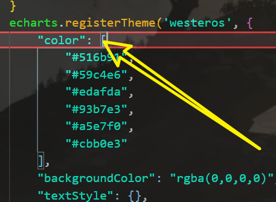
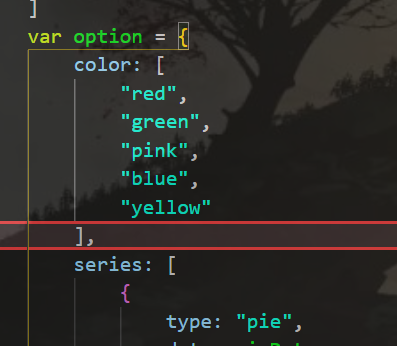
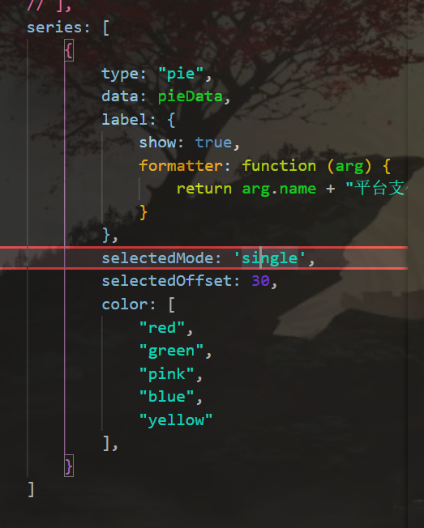

# 自定义主题
- 在主题编辑器中编辑主题
- 下载主题js文件
- 引入js
- 在init方法中使用
```js
echarts.registerTheme('westeros', {...}
```

# 调色盘

**主题调色盘**
- 就是color节点


**全局调色盘**
- 在option中配置color，配置之后会覆盖主题的调色盘


**局部调色盘**


**颜色渐变**


# 自适应
- 监听窗口大小变化事件
- 在事件处理函数中调用echarts实例对象的resize